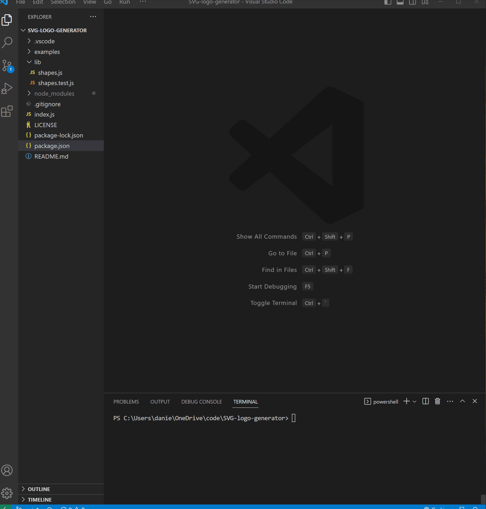

  ## Description
  This application takes user input to generate a simple SVG logo. The motivation behind developing this application was to implement newly learned Node.js techniques and modules. It is a basic logo maker that takes 4 user inputs. An application of this nature could be developed further to be an adequate logo maker that provides a shortcut for making attractive, personalized logos. 
   
  The application is run in Node.js using Inquirer.js for the user prompt interface. Jest is used as the testing framework. There are no HTML or CSS files in this project.
 

  ## Table of Contents
  * [Installation](#installation)
  * [Usage](#usage)
  * [License](#license)
  * [Tests](#tests)
  * [Credits](#credits)

  ## Installation
  To install dependencies, run `npm i` in the terminal.
  
  ## Usage
  After installing dependencies, the user can run the application through the terminal using `node index.js`. The user can enter up to 3 characters and pick the color of the text. After picking from either a circle, triangle, or square, the user can pick what color they want their logo background to be. The logo is then generated as logo.svg.

  
  Walkthrough video: https://drive.google.com/file/d/1-gw0z5WRK14gRElW-y9RrILyWU7_E2Ci/view

  
## License

This project is licensed under the [MIT](https://opensource.org/licenses/MIT) license.

  ## Tests
  To run tests, use the command `npm test`.

  ## Credits
  https://www.npmjs.com/package/inquirer 
  https://jestjs.io/docs/using-matchers 
  https://www.w3schools.com/js/js_class_inheritance.asp 
  https://htmlcolorcodes.com/ 
  https://www.w3.org/TR/SVGParamPrimer/ 

